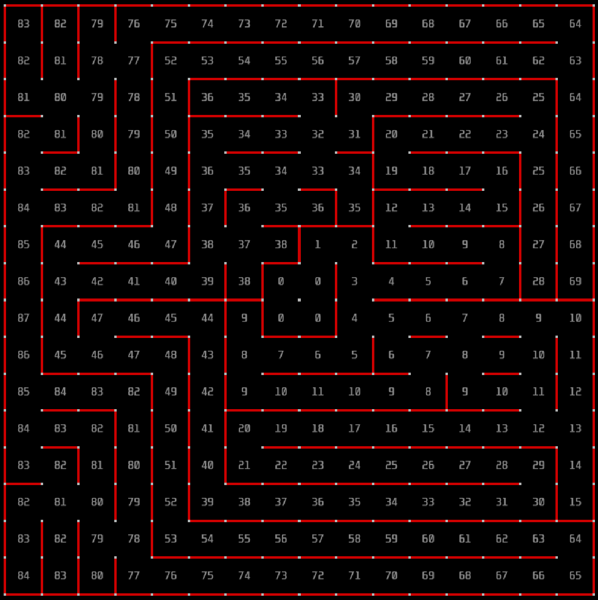
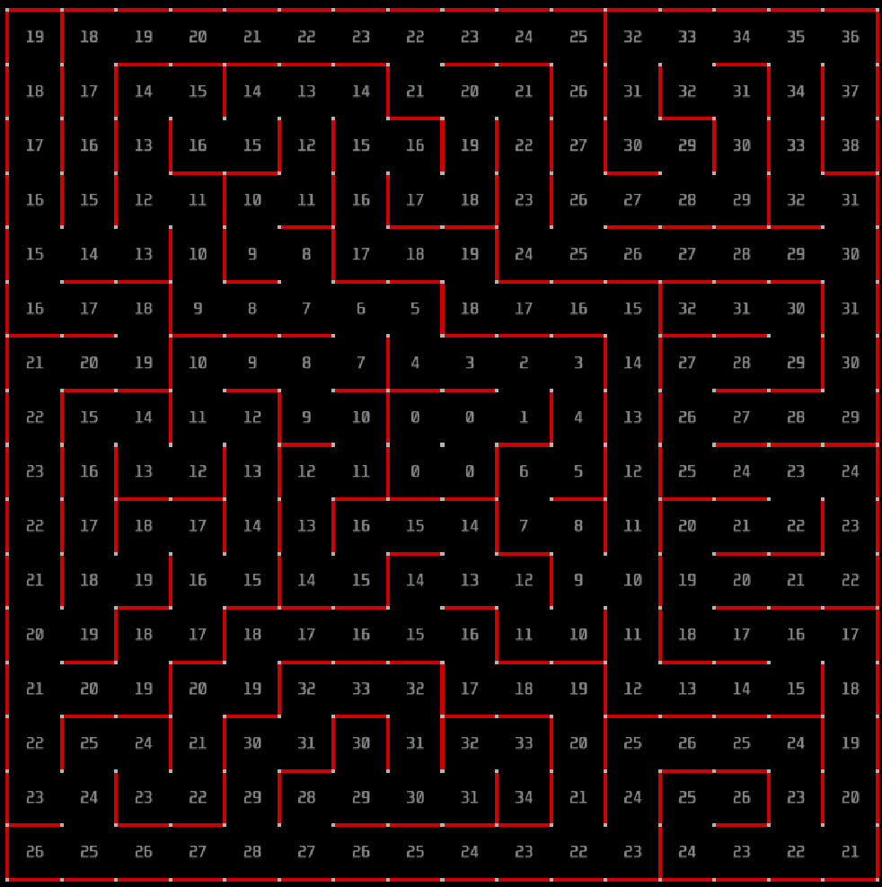
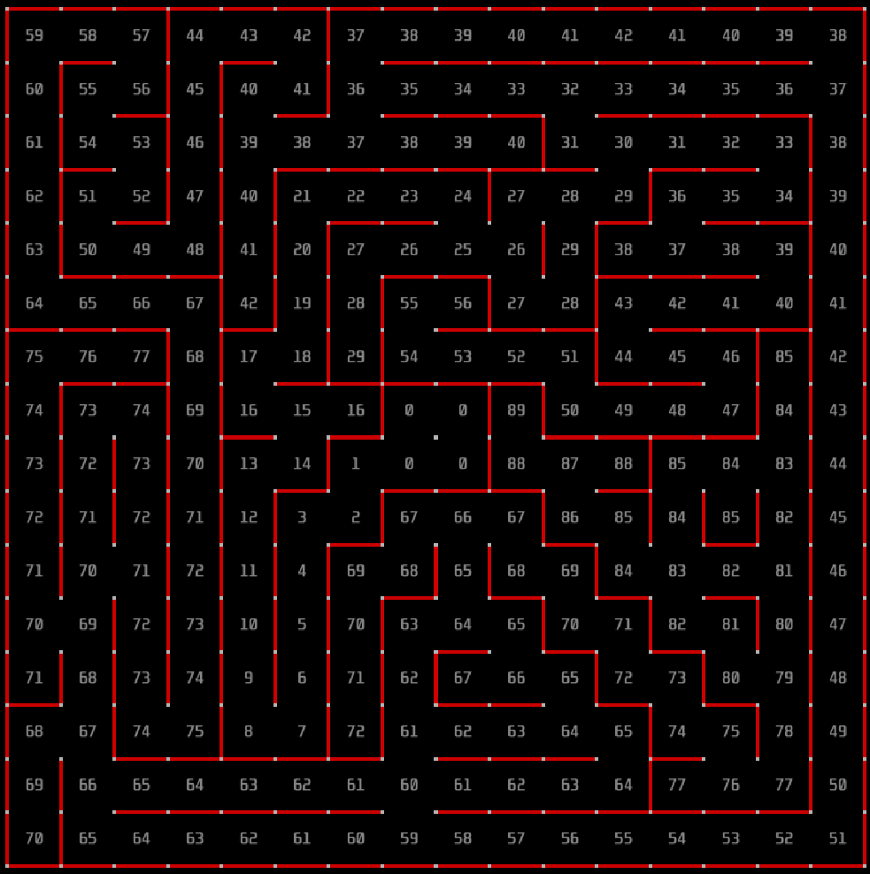
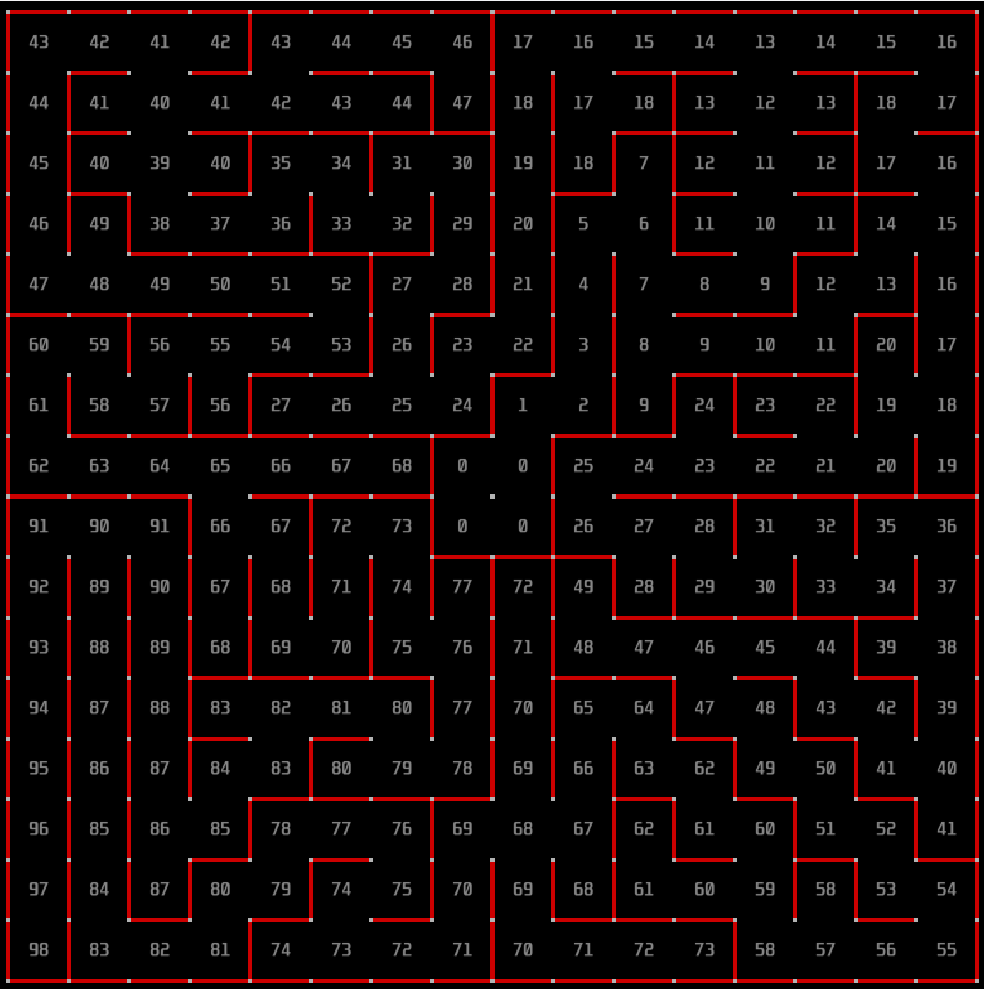

# Maze Solving Algorithms Assignment

## Overview
In this assignment, we tested three maze-solving algorithms on five different mazes using a simulator. The goal was to evaluate the performance of each algorithm based on whether the goal was reached and the time taken to do so.

## Algorithms

### 1. Lefthand Rule
The Lefthand Rule is a basic algorithm where the solver always keeps one hand on the left wall while navigating the maze.

**Advantages**:
- Simple and easy to implement.
- Guaranteed to find the exit in mazes with connected walls.

**Disadvantages**:
- Ineffective in mazes with disconnected loops.
- Can take longer in larger or more complex mazes.

---

### 2. Righthand Rule
Similar to the Lefthand Rule, the Righthand Rule follows the right wall.

**Advantages**:
- Easy implementation.
- Works in solvable mazes with connected paths.

**Disadvantages**:
- Inefficient for complex or large mazes.
- Cannot solve mazes with disconnected sections.

---

### 3. Floodfill Algorithm
Floodfill is an advanced algorithm that explores all possible paths to find the shortest route to the goal.

**Advantages**:
- Efficient in finding the shortest path.
- Can solve all types of mazes.

**Disadvantages**:
- More complex and resource-intensive.
- Requires higher memory and processing power.

---

## Implementation

### Lefthand Rule
The Lefthand Rule was implemented by continuously keeping a virtual "left hand" on the maze wall and following it until the goal was found or the maze was deemed unsolvable.

### Righthand Rule
The Righthand Rule is implemented in the same way as the Lefthand Rule but with a focus on the right-hand wall instead.

### Floodfill Algorithm
The Floodfill Algorithm uses a systematic approach to explore all potential paths, ensuring the shortest path is found for solvable mazes.

---

## Application Process

### Simulator Overview
The simulator used in this assignment provides five different mazes and allows Python-based customization for algorithm implementation. You can find more details about the simulator and how to set it up at these links:

- [Simulator GitHub Repository](https://github.com/mackorone/mms)
- [Python Interface for Maze Simulator](https://github.com/mackorone/mms-python)

### Steps for Application
1. **Setting Up the Simulator**:
   - Clone the repository and install required dependencies.
   - Ensure the Python environment is configured correctly.

2. **Implementing Algorithms**:
   - Implement the Lefthand Rule, Righthand Rule, and Floodfill Algorithm in Python.
   - Test each algorithm for proper interaction with the simulator.

3. **Testing and Recording Results**:
   - Run the algorithms on the five mazes.
   - Record the completion time and whether the goal was reached.

4. **Documenting Results**:
   - Screenshots of the mazes and videos of the algorithms solving them are provided below.

---

## Maze Screenshots
Below are the screenshots of the five mazes used in this assignment:

- **Maze 1**  
  

- **Maze 2**  
  

- **Maze 3**  
  

- **Maze 4**  
  

- **Maze 5**  
  

---

## Videos of Algorithm Execution
Below are the video demonstrations of each algorithm applied to all five mazes:

- **Lefthand Rule**: [Watch Video](path/to/lefthand_rule_video.mp4)
- **Righthand Rule**: [Watch Video](path/to/righthand_rule_video.mp4)
- **Floodfill Algorithm**: [Watch Video](path/to/floodfill_video.mp4)

---

## Results

### Lefthand Rule
| Maze ID | Find Goal | Completion Time (s) |
|---------|-----------|---------------------|
| 1       | Yes       | 10.06               |
| 2       | Yes       | 5.14                |
| 3       | No        | Inf                 |
| 4       | No        | Inf                 |
| 5       | Yes       | 11.17               |

### Righthand Rule
| Maze ID | Find Goal | Completion Time (s) |
|---------|-----------|---------------------|
| 1       | Yes       | 6.62                |
| 2       | Yes       | 3.29                |
| 3       | No        | Inf                 |
| 4       | No        | Inf                 |
| 5       | Yes       | 7.08                |

### Floodfill Algorithm
| Maze ID | Find Goal | Completion Time (s) |
|---------|-----------|---------------------|
| 1       | Yes       | 12.18               |
| 2       | Yes       | 4.38                |
| 3       | Yes       | 14.96               |
| 4       | Yes       | 16.00               |
| 5       | Yes       | 39.22               |

---

## Conclusion
- **Lefthand and Righthand Rules**: Simple but not guaranteed to solve all mazes. Slower in more complex setups.
- **Floodfill Algorithm**: Reliable and efficient in finding solutions for all mazes, though it is computationally expensive.

The Floodfill Algorithm is the most effective approach for solving mazes, but the simplicity of the Lefthand and Righthand Rules makes them useful for simpler tasks or when resources are limited.
